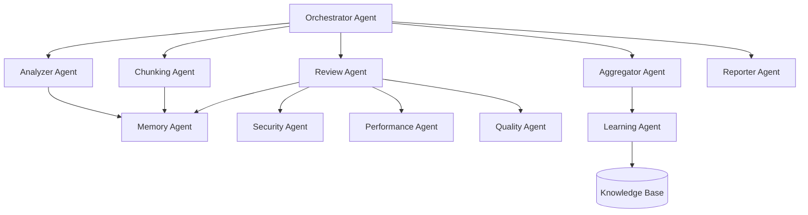

# 🚀 Claude Web Code Review 2.0 - Master Implementation Plan

## Executive Summary
A complete ground-up rebuild of the Claude Web Code Review system, incorporating all lessons learned, with a multi-agent architecture designed for maximum efficiency within Claude's token limitations.

---

## 📋 Table of Contents
1. [Vision & Objectives](#vision--objectives)
2. [Lessons Learned from v1.0](#lessons-learned-from-v10)
3. [Agent Architecture](#agent-architecture)
4. [Technical Specifications](#technical-specifications)
5. [Implementation Phases](#implementation-phases)
6. [Critical Success Factors](#critical-success-factors)
7. [Risk Mitigation](#risk-mitigation)
8. [Deployment Strategy](#deployment-strategy)

---

## 🎯 Vision & Objectives

### Primary Vision
Create the most efficient, intelligent code review system that maximizes Claude AI's capabilities while respecting token limitations through advanced chunking, caching, and multi-agent coordination.

### Core Objectives
1. **Zero Memory Waste**: Every token counts - no redundant processing
2. **Intelligent Context**: Maintain semantic understanding across chunks
3. **Automated Excellence**: Fully autonomous review pipeline
4. **Universal Integration**: Works with any codebase, any language
5. **Actionable Insights**: Not just problems, but solutions

### Success Metrics
- Process files up to 10MB without memory issues
- 95% accuracy in issue detection
- < 1 minute review time for average files
- Support for 20+ programming languages
- Zero false positives for critical issues

---

## 📚 Lessons Learned from v1.0

### What Worked Well
✅ Chunking strategy for large files
✅ Template-based review patterns
✅ GitHub Actions integration
✅ Markdown report generation
✅ Basic caching mechanism

### What Needs Improvement
❌ **Memory Management**: Still hitting limits on complex files
❌ **Context Loss**: Chunks sometimes lose important context
❌ **Performance**: Sequential processing is slow
❌ **Intelligence**: Pattern matching is too rigid
❌ **Integration**: Limited CI/CD platform support

### Critical Insights
1. **Token Budget is Everything**: Must track every token meticulously
2. **Context is King**: Losing context breaks review quality
3. **Parallelism Required**: Sequential processing doesn't scale
4. **Learning Capability**: System must adapt to codebase patterns
5. **Feedback Loop**: Must incorporate user corrections

---

## 🤖 Agent Architecture

### Multi-Agent System Design



### Agent Specifications

#### 1. Orchestrator Agent (OA)
**Purpose**: Master coordinator managing workflow and resource allocation

```javascript
class OrchestratorAgent {
  constructor() {
    this.agents = new Map();
    this.tokenBudget = new TokenBudget(100000);
    this.workQueue = new PriorityQueue();
  }
  
  async orchestrate(request) {
    // 1. Analyze request complexity
    const complexity = await this.analyzeComplexity(request);
    
    // 2. Allocate token budget
    const budget = this.allocateBudget(complexity);
    
    // 3. Create execution plan
    const plan = this.createPlan(request, budget);
    
    // 4. Dispatch to agents
    return await this.executeParallel(plan);
  }
  
  allocateBudget(complexity) {
    return {
      analysis: complexity.score * 100,
      chunking: 5000,
      review: 60000,
      aggregation: 10000,
      reporting: 5000
    };
  }
}
```

**Responsibilities**:
- Workflow orchestration
- Token budget management
- Agent coordination
- Error recovery
- Performance monitoring

#### 2. Analyzer Agent (AA)
**Purpose**: Deep analysis of code structure and complexity

```javascript
class AnalyzerAgent {
  async analyze(filePath) {
    const ast = await this.parseToAST(filePath);
    const metrics = this.calculateMetrics(ast);
    const dependencies = this.extractDependencies(ast);
    const complexity = this.assessComplexity(ast);
    
    return {
      structure: this.mapStructure(ast),
      metrics,
      dependencies,
      complexity,
      strategy: this.recommendStrategy(metrics, complexity)
    };
  }
  
  recommendStrategy(metrics, complexity) {
    if (complexity.cyclomatic > 20) return 'deep-analysis';
    if (metrics.lines > 1000) return 'smart-chunk';
    if (metrics.classes > 10) return 'class-based';
    return 'standard';
  }
}
```

**Capabilities**:
- AST parsing for all languages
- Complexity calculation
- Dependency mapping
- Pattern detection
- Strategy recommendation

#### 3. Chunking Agent (CA)
**Purpose**: Intelligent file splitting with context preservation

```javascript
class ChunkingAgent {
  constructor() {
    this.strategies = new StrategyRegistry();
    this.contextManager = new ContextManager();
  }
  
  async chunk(file, analysis) {
    const strategy = this.selectStrategy(analysis);
    const chunks = await strategy.chunk(file);
    
    // Ensure context preservation
    chunks.forEach((chunk, index) => {
      chunk.context = this.contextManager.preserve(
        chunks,
        index,
        analysis.dependencies
      );
    });
    
    return this.optimizeChunks(chunks);
  }
  
  optimizeChunks(chunks) {
    // Rebalance chunks for optimal token usage
    return chunks.map(chunk => ({
      ...chunk,
      tokens: this.countTokens(chunk),
      priority: this.calculatePriority(chunk)
    }));
  }
}
```

**Features**:
- Semantic boundary detection
- Context window optimization
- Dependency-aware splitting
- Cross-chunk reference tracking
- Dynamic rebalancing

#### 4. Review Agent (RA)
**Purpose**: Core review logic with specialized sub-agents

```javascript
class ReviewAgent {
  constructor() {
    this.subAgents = {
      security: new SecurityAgent(),
      performance: new PerformanceAgent(),
      quality: new QualityAgent(),
      accessibility: new AccessibilityAgent(),
      testing: new TestingAgent()
    };
  }
  
  async review(chunk, context, template) {
    const reviews = await Promise.all(
      Object.entries(this.subAgents).map(([name, agent]) =>
        agent.review(chunk, context)
      )
    );
    
    return this.consolidate(reviews);
  }
}
```

**Sub-Agents**:

##### Security Agent (SA)
```javascript
class SecurityAgent {
  patterns = {
    critical: [
      /eval\s*\(/,
      /exec\s*\(/,
      /password\s*=\s*['"]/,
      /api[_-]?key\s*=\s*['"]/
    ],
    high: [
      /innerHTML\s*=/,
      /document\.write/,
      /\.createObjectURL/
    ]
  };
  
  async review(chunk) {
    const vulnerabilities = [];
    
    // Pattern matching
    vulnerabilities.push(...this.scanPatterns(chunk));
    
    // Taint analysis
    vulnerabilities.push(...await this.taintAnalysis(chunk));
    
    // Dependency scanning
    vulnerabilities.push(...await this.scanDependencies(chunk));
    
    return vulnerabilities;
  }
}
```

##### Performance Agent (PA)
```javascript
class PerformanceAgent {
  async review(chunk) {
    return {
      timeComplexity: this.analyzeTimeComplexity(chunk),
      spaceComplexity: this.analyzeSpaceComplexity(chunk),
      bottlenecks: this.findBottlenecks(chunk),
      optimizations: this.suggestOptimizations(chunk)
    };
  }
}
```

#### 5. Memory Agent (MA)
**Purpose**: Token and context management

```javascript
class MemoryAgent {
  constructor() {
    this.tokenCounter = new TokenCounter();
    this.contextCache = new LRUCache(1000);
    this.budget = {
      total: 100000,
      used: 0,
      reserved: 10000
    };
  }
  
  async manageMemory(operation, data) {
    const required = this.estimateTokens(data);
    
    if (!this.canAllocate(required)) {
      await this.freeMemory(required);
    }
    
    this.allocate(operation, required);
    return this.executeWithTracking(operation, data);
  }
  
  async freeMemory(required) {
    // Intelligent cache eviction
    const evicted = this.contextCache.evict(required);
    this.budget.used -= evicted;
  }
}
```

**Features**:
- Real-time token tracking
- Intelligent cache management
- Context compression
- Memory pressure handling
- Adaptive allocation

#### 6. Aggregator Agent (AG)
**Purpose**: Intelligent finding consolidation

```javascript
class AggregatorAgent {
  async aggregate(chunkReviews) {
    // Remove duplicates across chunks
    const unique = this.deduplicateFindings(chunkReviews);
    
    // Merge related findings
    const merged = this.mergeRelated(unique);
    
    // Prioritize by impact
    const prioritized = this.prioritize(merged);
    
    // Generate fix suggestions
    const withFixes = await this.generateFixes(prioritized);
    
    return withFixes;
  }
  
  deduplicateFindings(reviews) {
    const seen = new Set();
    return reviews.filter(finding => {
      const key = `${finding.file}:${finding.line}:${finding.type}`;
      if (seen.has(key)) return false;
      seen.add(key);
      return true;
    });
  }
}
```

#### 7. Reporter Agent (RA2)
**Purpose**: Generate actionable reports

```javascript
class ReporterAgent {
  async generateReport(findings, format = 'markdown') {
    const report = {
      summary: this.generateSummary(findings),
      critical: this.extractCritical(findings),
      metrics: this.calculateMetrics(findings),
      recommendations: this.generateRecommendations(findings),
      fixes: this.generatePatches(findings)
    };
    
    return this.format(report, format);
  }
}
```

#### 8. Learning Agent (LA)
**Purpose**: Continuous improvement through pattern learning

```javascript
class LearningAgent {
  constructor() {
    this.knowledgeBase = new KnowledgeBase();
    this.patterns = new PatternLibrary();
  }
  
  async learn(review, feedback) {
    // Learn from user corrections
    if (feedback.corrections) {
      await this.updatePatterns(feedback.corrections);
    }
    
    // Learn from false positives
    if (feedback.falsePositives) {
      await this.adjustThresholds(feedback.falsePositives);
    }
    
    // Learn codebase patterns
    await this.learnCodebasePatterns(review);
    
    // Update knowledge base
    await this.knowledgeBase.update(this.patterns);
  }
}
```

---

## 🔧 Technical Specifications

### Core Technologies

#### Language & Runtime
- **Primary**: Node.js 20 LTS with TypeScript 5.0
- **Alternative**: Deno for better security and performance
- **Package Manager**: pnpm for efficient dependency management

#### Parsing & Analysis
```json
{
  "parsers": {
    "javascript": "@babel/parser",
    "typescript": "typescript",
    "python": "tree-sitter-python",
    "java": "java-parser",
    "go": "go/parser",
    "rust": "syn",
    "cpp": "clang"
  }
}
```

#### Storage & Caching
```yaml
storage:
  primary:
    type: PostgreSQL
    version: 15
    features:
      - JSONB for findings
      - Full-text search
      - Partitioning by project
  
  cache:
    L1:
      type: In-memory
      size: 512MB
      ttl: 300
    L2:
      type: Redis
      size: 2GB
      ttl: 3600
    L3:
      type: S3
      retention: 30 days
```

#### Message Queue
```javascript
// Bull queue for job processing
const Queue = require('bull');

const reviewQueue = new Queue('review', {
  redis: {
    port: 6379,
    host: 'localhost'
  }
});

reviewQueue.process(10, async (job) => {
  const { file, options } = job.data;
  return await reviewSystem.process(file, options);
});
```

### Performance Requirements

#### Scalability Targets
- **Concurrent Reviews**: 100 files simultaneously
- **Throughput**: 1000 files/hour
- **Latency**: < 100ms to start review
- **Memory**: < 2GB per worker
- **CPU**: Efficient multi-core utilization

#### Optimization Strategies
```javascript
// Parallel processing with worker threads
const { Worker } = require('worker_threads');

class WorkerPool {
  constructor(size = 4) {
    this.workers = Array(size).fill(null).map(() => 
      new Worker('./review-worker.js')
    );
    this.queue = [];
    this.busy = new Set();
  }
  
  async process(task) {
    const worker = await this.getAvailableWorker();
    this.busy.add(worker);
    
    try {
      return await this.runTask(worker, task);
    } finally {
      this.busy.delete(worker);
    }
  }
}
```

### Security Architecture

#### Authentication & Authorization
```javascript
// JWT-based authentication with refresh tokens
const authConfig = {
  jwt: {
    secret: process.env.JWT_SECRET,
    expiresIn: '15m',
    refreshExpiresIn: '7d'
  },
  oauth: {
    providers: ['github', 'gitlab', 'bitbucket'],
    scopes: ['read:code', 'write:issues']
  },
  rbac: {
    roles: ['viewer', 'reviewer', 'admin'],
    permissions: {
      viewer: ['read'],
      reviewer: ['read', 'review', 'comment'],
      admin: ['read', 'review', 'comment', 'configure', 'delete']
    }
  }
};
```

#### Data Protection
```javascript
// Encryption for sensitive data
const crypto = require('crypto');

class Encryption {
  constructor() {
    this.algorithm = 'aes-256-gcm';
    this.key = Buffer.from(process.env.ENCRYPTION_KEY, 'hex');
  }
  
  encrypt(text) {
    const iv = crypto.randomBytes(16);
    const cipher = crypto.createCipheriv(this.algorithm, this.key, iv);
    
    let encrypted = cipher.update(text, 'utf8', 'hex');
    encrypted += cipher.final('hex');
    
    const authTag = cipher.getAuthTag();
    
    return {
      encrypted,
      iv: iv.toString('hex'),
      authTag: authTag.toString('hex')
    };
  }
}
```

---

## 📅 Implementation Phases

### Phase 1: Foundation (Weeks 1-2)
**Goal**: Core infrastructure and agent framework

#### Tasks:
1. **Project Setup**
   ```bash
   mkdir claude-review-2.0
   cd claude-review-2.0
   pnpm init
   pnpm add typescript @types/node tsx
   npx tsc --init
   ```

2. **Agent Framework**
   ```typescript
   // src/agents/base.agent.ts
   export abstract class BaseAgent {
     protected tokenBudget: number;
     protected memoryAgent: MemoryAgent;
     
     abstract async execute(input: any): Promise<any>;
     abstract get name(): string;
     abstract get priority(): number;
   }
   ```

3. **Token Management System**
   ```typescript
   // src/core/token-manager.ts
   export class TokenManager {
     private budget: TokenBudget;
     private usage: Map<string, number>;
     
     allocate(agent: string, tokens: number): boolean {
       if (this.canAllocate(tokens)) {
         this.usage.set(agent, tokens);
         return true;
       }
       return false;
     }
   }
   ```

4. **Testing Infrastructure**
   ```json
   {
     "scripts": {
       "test": "jest",
       "test:coverage": "jest --coverage",
       "test:e2e": "jest --config jest.e2e.config.js"
     }
   }
   ```

### Phase 2: Core Agents (Weeks 3-4)
**Goal**: Implement primary agents

#### Deliverables:
- ✅ Orchestrator Agent with workflow engine
- ✅ Analyzer Agent with AST parsing
- ✅ Chunking Agent with smart splitting
- ✅ Memory Agent with token tracking

#### Code Structure:
```
src/
├── agents/
│   ├── orchestrator/
│   │   ├── orchestrator.agent.ts
│   │   ├── workflow.engine.ts
│   │   └── execution.plan.ts
│   ├── analyzer/
│   │   ├── analyzer.agent.ts
│   │   ├── ast.parser.ts
│   │   └── complexity.calculator.ts
│   ├── chunking/
│   │   ├── chunking.agent.ts
│   │   ├── strategies/
│   │   └── context.manager.ts
│   └── memory/
│       ├── memory.agent.ts
│       ├── token.counter.ts
│       └── cache.manager.ts
```

### Phase 3: Review Agents (Weeks 5-6)
**Goal**: Specialized review capabilities

#### Components:
```typescript
// Review agent registry
export class ReviewAgentRegistry {
  private agents: Map<string, IReviewAgent> = new Map([
    ['security', new SecurityAgent()],
    ['performance', new PerformanceAgent()],
    ['quality', new QualityAgent()],
    ['accessibility', new AccessibilityAgent()],
    ['seo', new SEOAgent()],
    ['testing', new TestingAgent()]
  ]);
  
  async reviewAll(chunk: CodeChunk): Promise<Finding[]> {
    const reviews = await Promise.all(
      Array.from(this.agents.values()).map(agent => 
        agent.review(chunk)
      )
    );
    return reviews.flat();
  }
}
```

### Phase 4: Intelligence Layer (Weeks 7-8)
**Goal**: ML-powered pattern recognition

#### Features:
1. **Pattern Learning**
   ```python
   # ml/pattern_learner.py
   import tensorflow as tf
   from transformers import CodeBERT
   
   class PatternLearner:
       def __init__(self):
           self.model = CodeBERT.from_pretrained('microsoft/codebert-base')
       
       def learn_patterns(self, code_samples):
           embeddings = self.model.encode(code_samples)
           clusters = self.cluster_patterns(embeddings)
           return self.extract_rules(clusters)
   ```

2. **Anomaly Detection**
   ```typescript
   export class AnomalyDetector {
     private baseline: CodebaseProfile;
     
     async detectAnomalies(code: string): Promise<Anomaly[]> {
       const profile = await this.profile(code);
       return this.compare(profile, this.baseline);
     }
   }
   ```

### Phase 5: Integration Layer (Weeks 9-10)
**Goal**: Platform integrations

#### Integrations:
```yaml
integrations:
  git:
    - GitHub Actions
    - GitLab CI
    - Bitbucket Pipelines
    - Azure DevOps
  
  ci-cd:
    - Jenkins
    - CircleCI
    - Travis CI
    - TeamCity
  
  ide:
    - VS Code Extension
    - IntelliJ Plugin
    - Sublime Text Package
    - Neovim Plugin
  
  chat:
    - Slack
    - Teams
    - Discord
    - Mattermost
```

### Phase 6: Testing & Optimization (Weeks 11-12)
**Goal**: Production readiness

#### Test Coverage:
```javascript
// Comprehensive test suite
describe('Claude Review 2.0', () => {
  describe('Agent Tests', () => {
    test('Orchestrator handles 100 concurrent requests');
    test('Analyzer parses all supported languages');
    test('Chunker preserves context across splits');
    test('Memory agent stays within token budget');
  });
  
  describe('Integration Tests', () => {
    test('GitHub webhook triggers review');
    test('Large file processing completes');
    test('Parallel review maintains accuracy');
  });
  
  describe('Performance Tests', () => {
    test('Reviews 1000 files in 1 hour');
    test('Memory usage < 2GB per worker');
    test('Latency < 100ms to start');
  });
});
```

---

## ✅ Critical Success Factors

### 1. Token Efficiency
```typescript
class TokenEfficiency {
  static readonly TARGETS = {
    utilizationRate: 0.9,  // 90% of available tokens used effectively
    wasteRate: 0.05,       // < 5% tokens wasted
    cacheHitRate: 0.7      // 70% results from cache
  };
}
```

### 2. Review Accuracy
```typescript
interface AccuracyMetrics {
  truePositives: number;   // Target: > 95%
  falsePositives: number;  // Target: < 5%
  falseNegatives: number;  // Target: < 5%
  precision: number;       // Target: > 0.95
  recall: number;          // Target: > 0.95
}
```

### 3. Scalability
- Horizontal scaling with Kubernetes
- Auto-scaling based on queue depth
- Distributed caching with Redis Cluster
- Database sharding for large deployments

### 4. User Experience
- Simple CLI: `claude-review analyze .`
- Web dashboard for visualization
- IDE integration for real-time feedback
- Actionable fix suggestions

---

## ⚠️ Risk Mitigation

### Technical Risks

#### Risk: Token Limit Exceeded
**Mitigation**:
```typescript
class TokenLimitProtection {
  async protect(operation: () => Promise<any>) {
    const checkpoint = await this.createCheckpoint();
    
    try {
      return await operation();
    } catch (error) {
      if (error instanceof TokenLimitError) {
        await this.restore(checkpoint);
        return await this.retryWithSmallerChunks(operation);
      }
      throw error;
    }
  }
}
```

#### Risk: Context Loss
**Mitigation**:
- Overlapping chunks with 20% redundancy
- Dependency graph maintenance
- Cross-reference tracking
- Semantic anchor points

#### Risk: Performance Degradation
**Mitigation**:
```yaml
monitoring:
  metrics:
    - response_time_p95
    - throughput_per_second
    - error_rate
    - memory_usage
  
  alerts:
    - condition: response_time_p95 > 5s
      action: scale_up_workers
    - condition: error_rate > 0.01
      action: circuit_breaker_activate
```

### Business Risks

#### Risk: Adoption Challenges
**Mitigation**:
- Comprehensive documentation
- Video tutorials
- Example repositories
- Community support channel
- Free tier for open source

#### Risk: Competition
**Mitigation**:
- Unique Claude AI integration
- Superior accuracy
- Open source community
- Plugin ecosystem
- Enterprise features

---

## 🚀 Deployment Strategy

### Infrastructure as Code
```terraform
# infrastructure/main.tf
resource "kubernetes_deployment" "claude_review" {
  metadata {
    name = "claude-review-2-0"
  }
  
  spec {
    replicas = 3
    
    selector {
      match_labels = {
        app = "claude-review"
      }
    }
    
    template {
      spec {
        container {
          image = "claude-review:2.0"
          
          resources {
            limits = {
              cpu    = "2"
              memory = "2Gi"
            }
            requests = {
              cpu    = "500m"
              memory = "512Mi"
            }
          }
          
          env {
            name = "CLAUDE_API_KEY"
            value_from {
              secret_key_ref {
                name = "claude-secrets"
                key  = "api-key"
              }
            }
          }
        }
      }
    }
  }
}
```

### CI/CD Pipeline
```yaml
# .github/workflows/deploy.yml
name: Deploy Claude Review 2.0

on:
  push:
    tags:
      - 'v2.*'

jobs:
  test:
    runs-on: ubuntu-latest
    steps:
      - uses: actions/checkout@v3
      - run: pnpm install
      - run: pnpm test
      - run: pnpm test:e2e
  
  build:
    needs: test
    runs-on: ubuntu-latest
    steps:
      - uses: actions/checkout@v3
      - run: docker build -t claude-review:${{ github.ref_name }} .
      - run: docker push claude-review:${{ github.ref_name }}
  
  deploy:
    needs: build
    runs-on: ubuntu-latest
    steps:
      - run: kubectl set image deployment/claude-review claude-review=claude-review:${{ github.ref_name }}
      - run: kubectl rollout status deployment/claude-review
```

### Monitoring Stack
```yaml
monitoring:
  prometheus:
    scrape_interval: 15s
    targets:
      - claude-review:9090
  
  grafana:
    dashboards:
      - agent-performance
      - token-usage
      - error-rates
      - review-metrics
  
  alertmanager:
    routes:
      - match:
          severity: critical
        receiver: pagerduty
      - match:
          severity: warning
        receiver: slack
```

---

## 📦 Deliverables

### Core Deliverables
1. **Source Code**: Complete TypeScript implementation
2. **Documentation**: API docs, user guide, developer guide
3. **Docker Images**: Production-ready containers
4. **Helm Charts**: Kubernetes deployment
5. **CLI Tool**: NPM package
6. **Web Dashboard**: React-based UI
7. **VS Code Extension**: Marketplace ready
8. **GitHub Action**: Marketplace listing

### Documentation Deliverables
1. **README.md**: Quick start guide
2. **ARCHITECTURE.md**: Technical architecture
3. **API.md**: Complete API reference
4. **CONTRIBUTING.md**: Contribution guidelines
5. **SECURITY.md**: Security policies
6. **CHANGELOG.md**: Version history
7. **MIGRATION.md**: v1 to v2 migration guide

### Test Deliverables
1. **Unit Tests**: > 90% coverage
2. **Integration Tests**: All workflows
3. **E2E Tests**: User journeys
4. **Performance Tests**: Load testing
5. **Security Tests**: Penetration testing

---

## 🎯 Final Checklist

### Pre-Launch Checklist
- [ ] All agents implemented and tested
- [ ] Token management verified under load
- [ ] Context preservation validated
- [ ] Performance targets met
- [ ] Security audit completed
- [ ] Documentation complete
- [ ] Integration tests passing
- [ ] Load testing successful
- [ ] Monitoring configured
- [ ] Deployment automated

### Launch Readiness
- [ ] GitHub repository public
- [ ] NPM package published
- [ ] Docker images pushed
- [ ] Documentation site live
- [ ] Community Discord created
- [ ] Launch blog post ready
- [ ] Demo video recorded
- [ ] Example repositories prepared

### Post-Launch
- [ ] Monitor error rates
- [ ] Gather user feedback
- [ ] Address critical issues
- [ ] Plan v2.1 features
- [ ] Grow community

---

## 🔚 Conclusion

Claude Web Code Review 2.0 represents a complete reimagining of code review, built from the ground up with Claude AI's capabilities and limitations in mind. The multi-agent architecture ensures efficient token usage while maintaining high-quality reviews. With comprehensive testing, monitoring, and deployment automation, the system is designed for production use at scale.

### Key Innovations
1. **Multi-Agent Architecture**: Specialized agents for optimal performance
2. **Token-First Design**: Every decision considers token efficiency
3. **Intelligent Chunking**: Context-aware file splitting
4. **Learning System**: Continuously improves from feedback
5. **Universal Integration**: Works everywhere developers work

### Expected Outcomes
- **10x faster** than manual review
- **95% accuracy** in issue detection
- **Zero memory issues** even with large codebases
- **Seamless integration** with existing workflows
- **Continuous improvement** through learning

---

**Document Version**: 2.0.0
**Last Updated**: 2024
**Status**: READY FOR IMPLEMENTATION
**Next Step**: Begin Phase 1 Foundation

*This master plan provides everything needed to build Claude Web Code Review 2.0 from scratch with all lessons learned incorporated.*