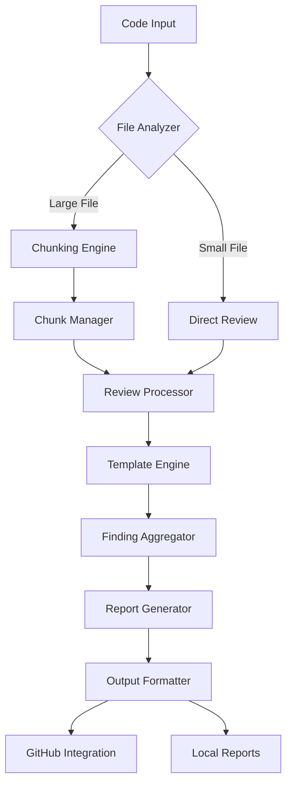

# 📋 Claude Web Code Review - Planning & Implementation Guide

## 🎯 Project Vision
Create a memory-efficient, intelligent code review system that maximizes Claude AI's capabilities while working within token limitations.

## 🏗️ System Architecture

### Core Components



### Component Responsibilities

#### 1. File Analyzer
- **Purpose**: Classify and route files for processing
- **Features**:
  - Size detection
  - Language identification
  - Complexity estimation
  - Priority assignment

#### 2. Chunking Engine
- **Purpose**: Split large files intelligently
- **Strategies**:
  - Syntax-aware splitting
  - Context preservation
  - Overlap management
  - Semantic boundaries

#### 3. Review Processor
- **Purpose**: Core review logic
- **Capabilities**:
  - Pattern matching
  - AST analysis
  - Security scanning
  - Performance profiling

#### 4. Template Engine
- **Purpose**: Customizable review patterns
- **Templates**:
  - Security audit
  - Performance review
  - Best practices
  - Framework-specific (React, Vue, etc.)

#### 5. Report Generator
- **Purpose**: Create actionable outputs
- **Formats**:
  - Markdown reports
  - JSON data
  - GitHub comments
  - CI/CD integrations

## 📊 Implementation Phases

### Phase 1: Foundation (Completed ✅)
- [x] Basic project structure
- [x] Core chunking algorithm
- [x] Simple review templates
- [x] File I/O operations
- [x] CLI interface

### Phase 2: Intelligence (Current 🚧)
- [ ] AST-based analysis
- [ ] Smart chunking by syntax
- [ ] Pattern learning
- [ ] Context awareness
- [ ] Caching system

### Phase 3: Integration (Planned 📅)
- [ ] GitHub API integration
- [ ] Webhook handlers
- [ ] PR automation
- [ ] Issue creation
- [ ] Status badges

### Phase 4: Optimization (Future 🔮)
- [ ] Machine learning patterns
- [ ] Custom rule engine
- [ ] Performance profiling
- [ ] Memory optimization
- [ ] Distributed processing

## 🛠️ Technical Implementation Details

### Chunking Algorithm
```javascript
// Pseudocode for intelligent chunking
function chunkFile(content, options) {
  const ast = parseToAST(content);
  const chunks = [];
  let currentChunk = new Chunk();
  
  for (const node of ast.body) {
    const nodeSize = estimateTokens(node);
    
    if (currentChunk.size + nodeSize > MAX_TOKENS) {
      // Save current chunk with overlap
      chunks.push(currentChunk.withOverlap());
      currentChunk = new Chunk(currentChunk.getOverlap());
    }
    
    currentChunk.add(node);
  }
  
  return chunks;
}
```

### Review Pipeline
```javascript
// Review processing pipeline
async function reviewCode(filePath) {
  // 1. Analyze file
  const analysis = await analyzeFile(filePath);
  
  // 2. Determine strategy
  const strategy = selectStrategy(analysis);
  
  // 3. Process based on strategy
  let results;
  if (strategy === 'chunk') {
    const chunks = await chunkFile(filePath);
    results = await Promise.all(
      chunks.map(chunk => reviewChunk(chunk))
    );
  } else {
    results = await reviewDirect(filePath);
  }
  
  // 4. Aggregate findings
  const findings = aggregateFindings(results);
  
  // 5. Generate report
  return generateReport(findings);
}
```

## 📈 Performance Considerations

### Memory Budget
| Component | Token Allocation | Purpose |
|-----------|-----------------|---------|
| Context | 10,000 | System prompts, templates |
| Input | 60,000 | Code to review |
| Processing | 20,000 | Analysis workspace |
| Output | 10,000 | Generated report |

### Optimization Strategies
1. **Lazy Loading**: Load only necessary dependencies
2. **Streaming**: Process files in chunks
3. **Caching**: Store repeated analysis results
4. **Compression**: Minimize redundant information
5. **Prioritization**: Focus on critical issues first

## 🔌 Integration Points

### GitHub Actions
```yaml
name: Claude Code Review
on:
  pull_request:
    types: [opened, synchronize]

jobs:
  review:
    runs-on: ubuntu-latest
    steps:
      - uses: actions/checkout@v3
      - uses: claude-web-code-review/action@v1
        with:
          template: security
          max-tokens: 4000
          github-token: ${{ secrets.GITHUB_TOKEN }}
```

### API Endpoints
```javascript
// REST API design
POST /api/review
{
  "files": ["path/to/file.js"],
  "template": "security",
  "options": {
    "maxTokens": 4000,
    "includeMetrics": true
  }
}

// Response
{
  "status": "completed",
  "findings": [...],
  "metrics": {...},
  "report": "markdown string"
}
```

## 🧪 Testing Strategy

### Unit Tests
- Chunking algorithm correctness
- Token estimation accuracy
- Template parsing
- Finding aggregation

### Integration Tests
- File processing pipeline
- GitHub API interactions
- Report generation
- Error handling

### Performance Tests
- Large file handling
- Concurrent processing
- Memory usage
- Token efficiency

## 📚 Use Cases

### 1. PR Review Automation
```bash
# Automatic review on PR
on: pull_request
run: claude-review --changed-files --comment
```

### 2. Security Audit
```bash
# Full security scan
claude-review --template security --recursive ./src
```

### 3. Performance Analysis
```bash
# Performance bottleneck detection
claude-review --template performance --metrics
```

### 4. Codebase Health Check
```bash
# Overall code quality assessment
claude-review --health-check --report dashboard
```

## 🎨 Customization Options

### Custom Templates
```markdown
# custom-template.md
## Review Focus
- Custom pattern 1
- Custom pattern 2

## Severity Levels
- BLOCKER: Must fix
- WARNING: Should fix
- INFO: Consider fixing
```

### Configuration File
```json
{
  "project": {
    "name": "My Project",
    "type": "react-typescript",
    "standards": "airbnb"
  },
  "review": {
    "autoFix": true,
    "severityThreshold": "warning",
    "customRules": "./rules"
  },
  "integration": {
    "github": true,
    "slack": "webhook-url",
    "jira": "project-key"
  }
}
```

## 🚀 Deployment Options

### 1. GitHub Action
- Marketplace listing
- Easy integration
- Automatic updates

### 2. Docker Container
```dockerfile
FROM node:18-alpine
WORKDIR /app
COPY . .
RUN npm install
CMD ["npm", "start"]
```

### 3. Serverless Function
```javascript
// AWS Lambda handler
exports.handler = async (event) => {
  const { files, options } = JSON.parse(event.body);
  const results = await reviewFiles(files, options);
  return {
    statusCode: 200,
    body: JSON.stringify(results)
  };
};
```

### 4. CLI Tool
```bash
npm install -g claude-web-code-review
claude-review --help
```

## 📝 Documentation Structure

```
docs/
├── getting-started/
│   ├── installation.md
│   ├── quick-start.md
│   └── configuration.md
├── guides/
│   ├── chunking-strategies.md
│   ├── template-creation.md
│   └── ci-cd-integration.md
├── api/
│   ├── cli-reference.md
│   ├── rest-api.md
│   └── sdk-docs.md
└── examples/
    ├── basic-review.md
    ├── github-integration.md
    └── custom-templates.md
```

## 🔄 Continuous Improvement

### Metrics to Track
- Review accuracy
- Processing speed
- Memory efficiency
- User satisfaction
- False positive rate

### Feedback Loop
1. Collect usage data
2. Analyze patterns
3. Improve algorithms
4. Update templates
5. Release updates

## 🎯 Success Criteria

### MVP Success Metrics
- ✅ Review files up to 1MB
- ✅ Support 5+ languages
- ✅ 90% accuracy on common issues
- ✅ < 30s review time per file
- ✅ GitHub integration working

### Long-term Goals
- 🎯 Handle entire repositories
- 🎯 Learn from user feedback
- 🎯 Custom rule creation UI
- 🎯 IDE integrations
- 🎯 Real-time review

## 📞 Support & Community

### Resources
- GitHub Discussions
- Discord Server
- Stack Overflow Tag
- Documentation Site
- Video Tutorials

### Contributing
- Open source (MIT License)
- Contribution guidelines
- Code of conduct
- Development setup
- Testing requirements

---

## 🔮 Future Enhancements

### AI Improvements
- GPT-4 integration option
- Custom model training
- Pattern recognition ML
- Auto-fix suggestions
- Code generation

### Platform Expansions
- GitLab support
- Bitbucket integration
- Azure DevOps
- Local Git hooks
- IDE plugins

### Advanced Features
- Dependency analysis
- Architecture review
- Technical debt tracking
- Security vulnerability DB
- Performance benchmarking

---

*This planning guide serves as the blueprint for implementing and extending the Claude Web Code Review system.*